# URL-Analysis

A native macOS web performance analysis tool with AI-powered insights, Core Web Vitals measurement, network waterfall inspection, Google Lighthouse integration, and request blocking.


---

## Features

| Feature | Description |
|---------|-------------|
| Network waterfall | Real-time HAR-compatible request waterfall with DNS, connect, SSL, TTFB, and download timing breakdowns |
| Performance scoring | Weighted composite score (0-100): load time 30%, resource count 20%, total size 20%, Web Vitals 30% |
| Core Web Vitals | LCP, CLS, and FID measurement via WKWebView JavaScript injection, scored against Google thresholds |
| Optimization suggestions | Automatic detection of uncompressed assets, render-blocking resources, oversized images with impact ratings |
| Third-party analysis | External domain identification, provider categorization (analytics, ads, CDN, social), load time impact measurement |
| Performance budgets | Configurable thresholds for page size, request count, load time, and individual resource sizes |
| Google Lighthouse | Full Lighthouse CLI via headless Chrome bridge with Performance, Accessibility, Best Practices, SEO, and PWA scores |
| AI analysis (9 backends) | Performance insights, security analysis, tech stack detection, privacy analysis, code fix generation, trend forecasting, regression detection |
| Ethical AI guardian | 100+ prohibited content patterns with automatic blocking and crisis resource referrals |
| Device emulation | Desktop, iPhone 15 Pro/Max, iPhone SE, iPad, iPad Pro profiles with viewport, pixel ratio, and user agent |
| Screenshot timeline | Page rendering filmstrip capture at 0s, 0.5s, 1s, 2s, 3s, 5s intervals |
| Request blocking | Block domains or resource types (ads, trackers, images, scripts) via WKContentRuleList injection |
| Session history | Automatic save of all analyses with full metrics, Web Vitals, device profile, and timestamp |
| Export | HAR v1.2 JSON export and multi-page PDF reports with executive summary and filmstrip |
| URL comparison | Multiple browser sessions in tabs for side-by-side performance comparison |
| Desktop widget | WidgetKit extension (Small / Medium / Large) with score, Web Vitals, and session history |
| Nova API server | HTTP API on port 37444 (loopback only) |

---

## Architecture

```mermaid
graph TD
    subgraph UI["SwiftUI Frontend"]
        URL[URL Bar + WKWebView Browser]
        TABS["Analysis Tabs<br/>Waterfall | Performance | Web Vitals<br/>Optimize | 3rd Party | Budgets<br/>AI Analysis | Lighthouse | Blocking"]
        FILM[Screenshot Timeline Filmstrip]
    end

    subgraph Analysis["Analysis Engine"]
        NM[NetworkMonitor<br/>WKWebView JS injection]
        PS[PerformanceScore<br/>Weighted composite]
        WV[WebVitals<br/>LCP / CLS / FID]
        OPT[OptimizationAnalyzer]
        TPA[ThirdPartyAnalyzer<br/>23 known providers]
        BM[BudgetManager]
        RB[RequestBlocking<br/>WKContentRuleList]
        SS[ScreenshotTimeline]
    end

    subgraph LH["Lighthouse Bridge"]
        LHM[LighthouseManager] --> CHROME["Google Chrome (headless)"]
    end

    subgraph AI["AI Subsystem (9 Backends)"]
        ABM[AIBackendManager<br/>Auto-detect + fallback]
        ABM --> LOCAL["Ollama :11434<br/>MLX | TinyLLM :8000<br/>OpenWebUI :8080"]
        ABM --> CLOUD["OpenAI | Google<br/>Azure | AWS | IBM"]
        EG[EthicalAIGuardian<br/>100+ content patterns]
    end

    subgraph Export["Export and Persistence"]
        HAR[HAR v1.2 JSON]
        PDF[PDF Report Generator]
        SHM[SessionHistoryManager]
        WDS[WidgetDataSync] --> WK[WidgetKit Extension]
    end

    subgraph API["Nova API :37444"]
        STATUS["GET /api/status"]
        PING["GET /api/ping"]
    end

    URL --> NM
    NM --> PS & WV & OPT & TPA & BM
    NM --> HAR & PDF
    NM --> SHM
    URL --> LHM
    URL --> ABM
    ABM --> EG
    API --> NM
```



---

## Installation

1. Download the latest DMG from [Releases](https://github.com/kochj23/URL-Analysis/releases)
2. Open the DMG and drag URL-Analysis.app to `/Applications`
3. No sandbox -- direct distribution via DMG

### Optional: Lighthouse

```bash
npm install -g lighthouse
# Chrome or Chromium must also be installed
```

### Optional: Local AI Backend

```bash
brew install ollama && ollama serve && ollama pull mistral:latest
```

## Requirements

| Requirement | Minimum |
|-------------|---------|
| macOS | 14.0 (Sonoma) |
| Architecture | Universal (Apple Silicon + Intel) |
| Lighthouse (optional) | Node.js + `lighthouse` npm + Chrome |
| AI (optional) | Any of 9 supported backends (5 local, 4 cloud) |

---

## Building

```bash
git clone https://github.com/kochj23/URL-Analysis.git
cd URL-Analysis
xcodebuild -project URL-Analysis.xcodeproj -scheme "URL-Analysis" -configuration Release build
```

## Testing

```bash
xcodebuild test -project URL-Analysis.xcodeproj -scheme "URL Analysis" -destination 'platform=macOS'
```

268 tests across 11 test files covering unit, security, functional, and integration categories:

| Test File | Tests | Category |
|-----------|------:|----------|
| ComprehensiveTests | 86 | Unit, security, integration, functional, frame -- URL parsing, CLI formatting, AI models, widget sync, view instantiation |
| NetworkMonitorTests | 28 | Unit -- ResourceTimings, ResourceFilter, NetworkThrottle, MIME detection, HAR encoding |
| WebVitalsTests | 24 | Unit -- LCP/CLS/FID scoring thresholds, boundary values, Codable, score clamping |
| PerformanceScoreTests | 24 | Unit -- load time / resource count / total size / Web Vitals scoring and weighting |
| EthicalGuardianTests | 23 | Security -- 100+ prohibited content regex patterns, false positive avoidance, regex validation |
| DeviceEmulationTests | 20 | Unit -- 10 device presets, fromString lookup, viewport description, Codable/Equatable |
| ThirdPartyAnalysisTests | 18 | Unit -- provider identification (23 providers), subdomain matching, impact classification |
| PersistentSessionTests | 15 | Unit -- domain extraction, performance rating, Codable, SessionMetadata, SessionIndex |
| SecurityTests | 14 | Security -- URL scheme validation, SSRF private IP detection, MIME priority, SHA256, API loopback |
| PerformanceBudgetTests | 8 | Unit -- Desktop/Mobile/PWA presets, default values, Codable, violation severity |
| RequestBlockingTests | 8 | Unit -- ads/trackers profile, images/scripts profiles, content rule JSON, Codable |

---

## AI Backends

| Backend | Type | Default Port |
|---------|------|-------------:|
| Ollama | Local | 11434 |
| MLX | Local | -- |
| TinyLLM | Local | 8000 |
| TinyChat | Local | 8000 |
| OpenWebUI | Local | 8080 |
| OpenAI | Cloud | -- |
| Google Cloud | Cloud | -- |
| Azure | Cloud | -- |
| AWS | Cloud | -- |
| IBM Watson | Cloud | -- |

All cloud API keys stored in macOS Keychain. The backend manager auto-detects available services on launch and falls back to the next backend on failure.

---

## License

MIT License -- Copyright (c) 2025 Jordan Koch

See [LICENSE](LICENSE) for the full text.

---

Written by Jordan Koch
